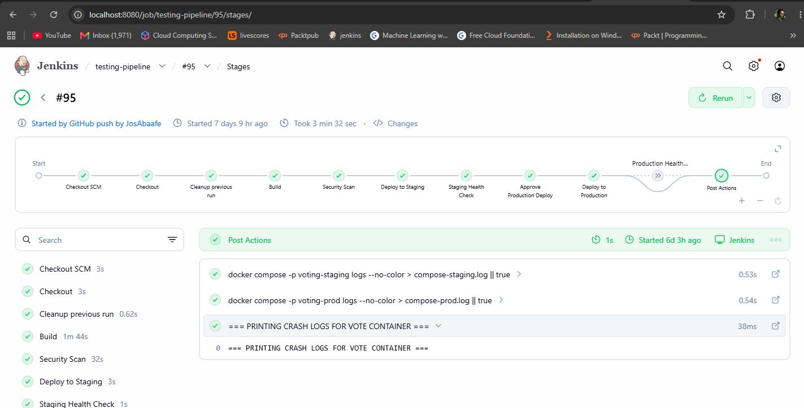

# 🚀 CI/CD Pipeline for the Example Voting Application

##  📖 Overview

This project demonstrates a **Continuous Integration and Continuous Deployment (CI/CD)** pipeline using **Jenkins, Docker, Docker Compose, and Trivy**. 


The pipeline automatically builds, scans, deploys, and validates the application whenever new code is pushed to the `main` branch.

### CI/CD Workflow

```text 
Developer
    │
    │ git push
    ▼
GitHub - main branch
    │
    │ Webhook
    ▼
Jenkins
    │
    ├── Checkout
    ├── Cleanup
    ├── Build
    ├── Trivy Security Scan
    ├── Deploy to Staging
    ├── Staging Health Check
    │
    ├── Manual Production Approval
    │
    ├── Deploy to Production
    └── Production Health Check
```

---
A manual approval gate ensures that production deployments only occur after authorization.

---

## 🚀 Pipeline Features

- ✅ Automatically checks out the latest source code from the `main` branch.
- 🧹 Cleans up containers, volumes, and orphaned services from previous runs.
- 🏗️ Builds Docker images from scratch.
- 🔒 Scans container images for security vulnerabilities using Trivy.
- 🧪 Deploys the application to a staging environment.
- ❤️ Performs health checks on staging services.
- 📧 Sends an email requesting approval before production deployment.
- ✋ Requires manual approval before deploying to production.
- 🚀 Deploys the approved build to production.
- 🩺 Performs production health checks.
- ❌ Sends email notifications when a build fails.
- 📄 Collects Docker Compose logs for troubleshooting.

---

## 🛠️ Technologies Used

| Technology | Purpose |
|------------|---------|
| **Jenkins** | CI/CD automation |
| **Docker** | Containerization |
| **Docker Compose** | Multi-container application orchestration |
| **Trivy** | Container vulnerability scanning |
| **GitHub** | Source code management |
| **Email Extension Plugin** | Deployment approval and failure notifications |

---

### Getting Started

## 1.Clone the Repository
Clone the project to the server where Jenkins will run:
```groovy
git clone https://github.com/JosAbaafe/example-voting-app.git
```

## 2. Navigate into the Application
```groovy
cd example-voting-app
```
Verify the project files:
```groovy
ls -la
```
You should see files such as:
```groovy
Jenkinsfile
docker-compose.yml
docker-compose.staging.yml
docker-compose.prod.yml
vote/
result/
worker/
redis/
db/
```
## 🐳 3. Start Jenkins

Jenkins is run as a Docker container.

The project uses a custom Jenkins image called:
```groovy
jenkins-docker
```
Start Jenkins using:
```groovy
docker run -d \
  --name jenkins \
  -p 8080:8080 \
  -p 5000:5000 \
  -v jenkins_home:/var/jenkins_home \
  -v /var/run/docker.sock:/var/run/docker.sock \
  jenkins-docker
```
Docker Volume

The following volume:
```groovy
jenkins_home:/var/jenkins_home
```
persists Jenkins configuration, jobs, plugins, and other Jenkins data even if the Jenkins container is recreated.

Docker Socket

The following mount:
```groovy
/var/run/docker.sock:/var/run/docker.sock
```
allows Jenkins to communicate with the Docker daemon on the host and execute Docker commands from the pipeline.

This is required because the Jenkins pipeline builds and deploys Docker containers.
---
## 🔍 4. Verify Jenkins

Check that the Jenkins container is running:
```groovy
docker ps
```
You should see:
```groovy
jenkins
```
You can also check the Jenkins logs:
```groovy
docker logs jenkins
```
To follow the logs:
```groovy
docker logs -f jenkins
```
---
## 🌐 5. Access Jenkins

Open Jenkins in your browser:
```groovy
http://YOUR_SERVER_IP:8080
```
For example:
```groovy
http://192.xxx.xxx.xxx:8080
```
Replace YOUR_SERVER_IP with the public IP address of your server.

---
## 🔑 6. Get the Jenkins Initial Admin Password

If this is a new Jenkins installation, retrieve the initial administrator password:

```bash
docker exec jenkins \
  cat /var/jenkins_home/secrets/initialAdminPassword
```
Copy the password and enter it into the Jenkins setup page.
---
## 🔌 7. Install Jenkins Plugins

During Jenkins setup, install the required plugins.

Recommended plugins include:
```groovy
Pipeline
Git
GitHub
GitHub Integration
Docker Pipeline
Email Extension
```
These plugins allow Jenkins to communicate with GitHub, execute pipelines, work with Docker, and send email notifications.
---
## 🔗 8. Create the Jenkins Pipeline

From the Jenkins dashboard:
```groovy
Dashboard
   ↓
New Item
   ↓
Pipeline
```
Give the pipeline a name:
```groovy
example-voting-app
```
Select:

Pipeline

Click OK.
---
## 📦 9. Connect Jenkins to GitHub

Under the pipeline configuration, select:
```groovry
Pipeline
```
For Definition, select:
```groovy
Pipeline script from SCM
```
For SCM, select:
```groovy
Git
```
Enter the repository URL:
```groovy
https://github.com/JosAbaafe/example-voting-app.git
```
Set the branch:
```groovy
*/main
```
Set the Jenkinsfile path:
```groovy
Jenkinsfile
```
Save the configuration.
---
## 🪝 10. Configure GitHub Webhook

The goal of this project is for a push to the main branch to automatically trigger Jenkins.
```groovy
In GitHub, open:

Repository
   ↓
Settings
   ↓
Webhooks
   ↓
Add webhook
```
---
## ⚙️ 11. Enable GitHub Trigger in Jenkins

Open the Jenkins pipeline configuration.

Go to:
```groovy
Build Triggers
```
Enable:

GitHub hook trigger for GITScm polling

Save the configuration.

Now Jenkins is configured to receive GitHub webhook events.
---
## 🔄 12. Trigger the Pipeline

Make sure you are working on the main branch:
```groovy
git checkout main
```
Make your changes and commit them:
```groovy
git add .
git commit -m "Update application"
```
Push the changes:
```groovy
git push origin main
```
The workflow will be:
```groovy
git push origin main
        │
        ▼
     GitHub
        │
        │ Webhook
        ▼
     Jenkins
        │
        ▼
  Pipeline starts
```
---
<br>
👤 Author

Emmanuel Awonate Abaafe<br>

DevSecOps | Cloud Computing | Data Science & Machine Learning
